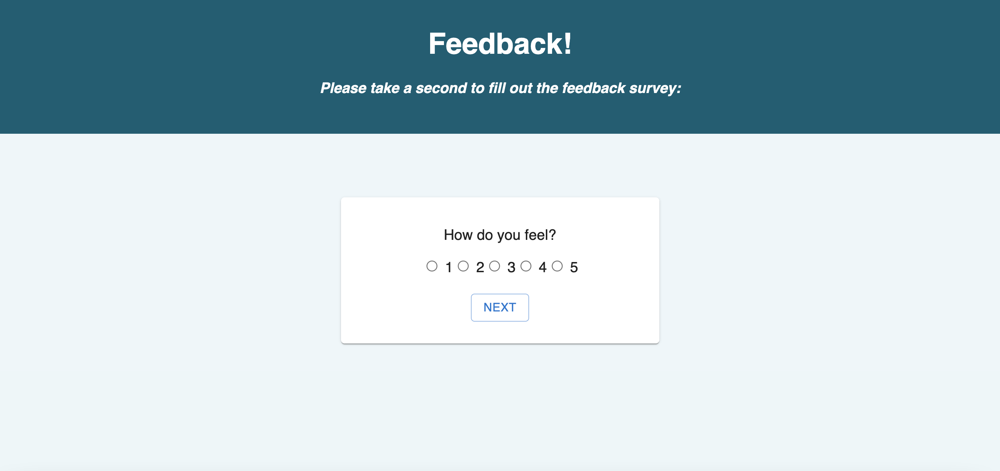
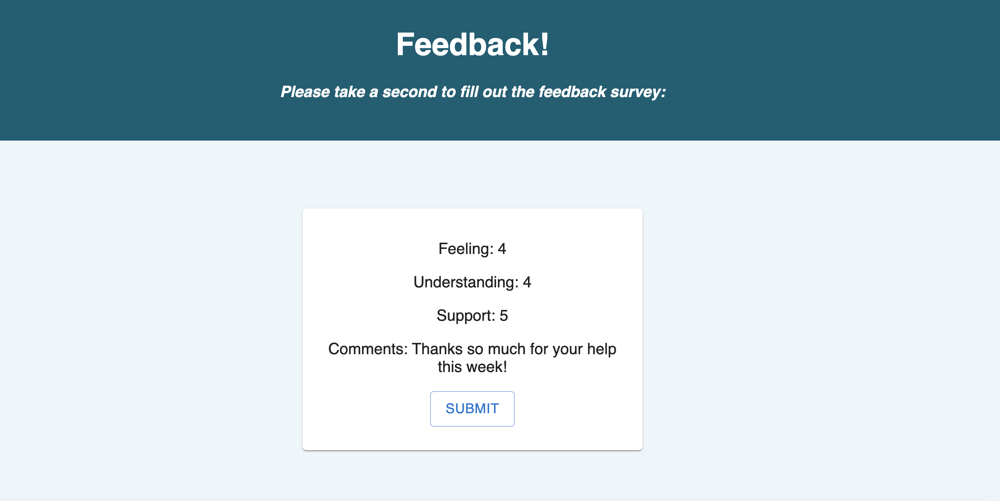
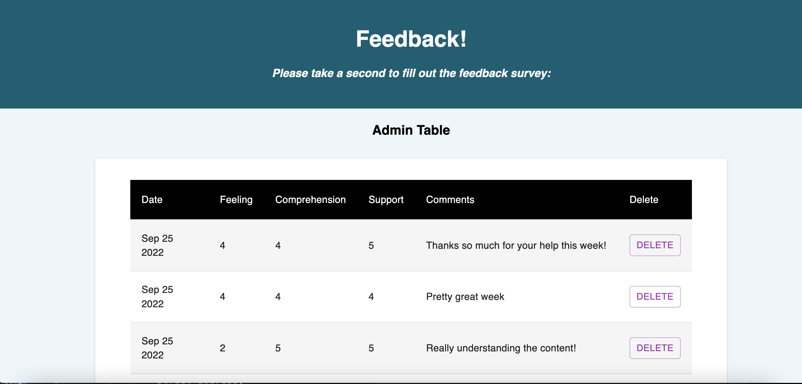

# Feedback Loop App

## Description

_Tier 2/Week 10_
_2 Day Sprint_

This app gathers daily student feedback to assess how they are feeling, how well they're understanding the material, and if they feel supported.

To see my repository, please visit: [GitHub Repository](https://github.com/sam-c-freeman/weekend-redux-feedback-loop)

## Screen Shots

## Usage
Features:

1. Collects data using a multi-page form
2. Allows the user to review their feedback and take a new survey
2. Includes an admin page (/admin) to see all previous entries
3. The admin page allows administrators to delete individual entries

## Built With

* HTML/CSS
* Javascript
* React
* Redux
* Axios
* SQL
* Material UI
* Node.js
* Express

## Acknowledgement
Thanks to [Prime Digital Academy](www.primeacademy.io) who helped me to make this application a reality. 

## Support
If you have suggestions or issues, please email me at: <samcfreeman888@gmail.com>